# 🗄️ Database Schema - Hearth App
**Firestore Database Layout with Mermaid Diagrams**

## 📊 Database Overview

The Hearth application uses Google Firestore as its NoSQL database. The schema is designed for scalability, security, and efficient querying while maintaining data integrity and user isolation.

### 🏗️ Architecture Principles
- **User Isolation**: All data is scoped to individual users
- **Security First**: Comprehensive Firestore rules enforce access control
- **Scalable Design**: Optimized for growth and performance
- **Audit Trail**: Complete tracking of creation and modification times
- **Flexible Schema**: Support for optional fields and future enhancements

## 📋 Collections Overview

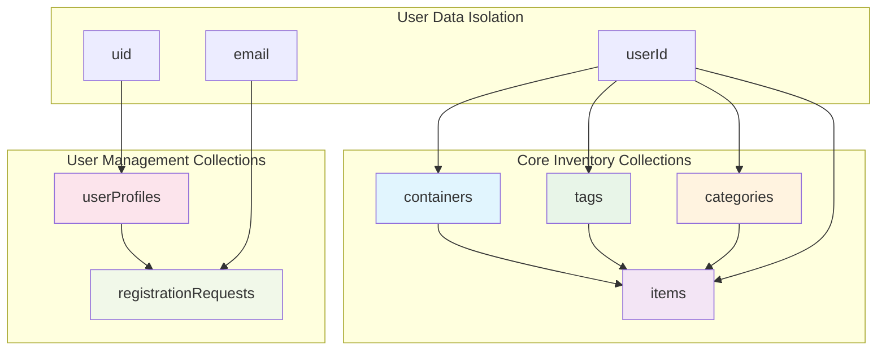

## 🏠 Core Inventory Schema

### 📦 Containers Collection

Containers represent physical storage locations where items are kept.

```mermaid
erDiagram
    containers {
        string id PK "Auto-generated document ID"
        string name "Container name (required, 1-100 chars)"
        string description "Optional description (max 500 chars)"
        string location "Optional location info (max 100 chars)"
        string imageUrl "Base64 encoded image or URL"
        string userId FK "Owner's Firebase Auth ID"
        timestamp createdAt "Creation timestamp"
     "
    }
```

**Example Document:**
```json
{
  "id": "container_abc123",
  "name": "Kitchen Drawer #3",
  "description": "Top drawer next to the stove",
  "location": "Kitchen",
  "imageUrl": "data:image/jpeg;base64,/9j/4AAQ...",
  "userId": "user_xyz789",
  "createdAt": "2024-12-11T10:30:00Z",
  "updatedAt": "2024-12-11T10:30:00Z"
}
```

### 📝 Items Collection

Items are individual objects stored within containers.

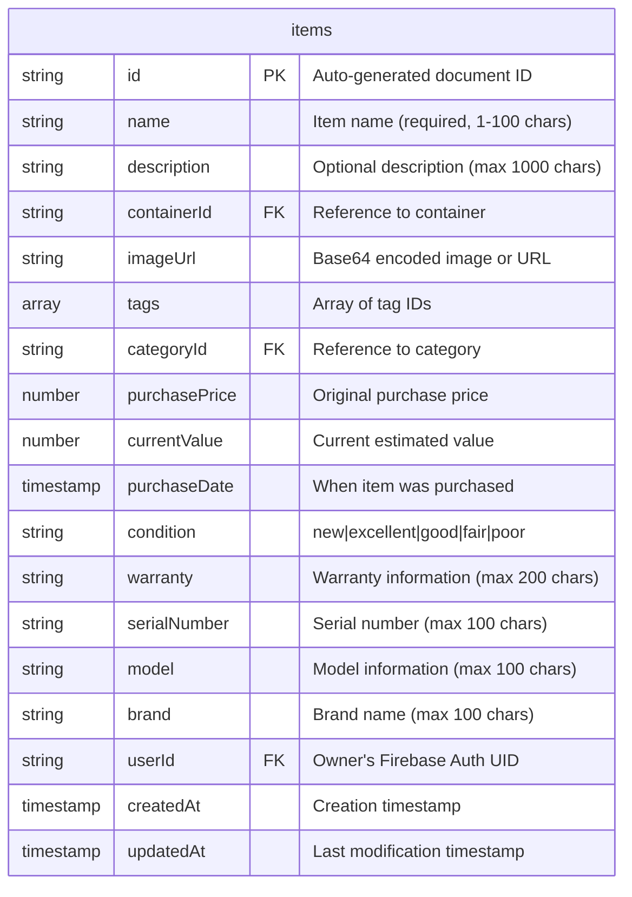

**Example Document:**
```json
{
  "id": "item_def456",
  "name": "Bluetooth Headphones",
  "description": "Sony WH-1000XM4 noise-canceling headphones",
  "containerId": "container_abc123",
  "imageUrl": "data:image/jpeg;base64,/9j/4AAQ...",
  "tags": ["tag_electronics", "tag_audio"],
  "categoryId": "category_electronics_audio",
  "purchasePrice": 299.99,
  "currentValue": 250.00,
  "purchaseDate": "2024-01-15T00:00:00Z",
  "condition": "excellent",
  "warranty": "2 year manufacturer warranty",
  "serialNumber": "SN123456789",
  "model": "WH-1000XM4",
  "brand": "Sony",
  "userId": "user_xyz789",
  "createdAt": "2024-12-11T10:35:00Z",
  "updatedAt": "2024-12-11T10:35:00Z"
}
```

### 🏷️ Tags Collection

Tags provide flexible labeling for items.

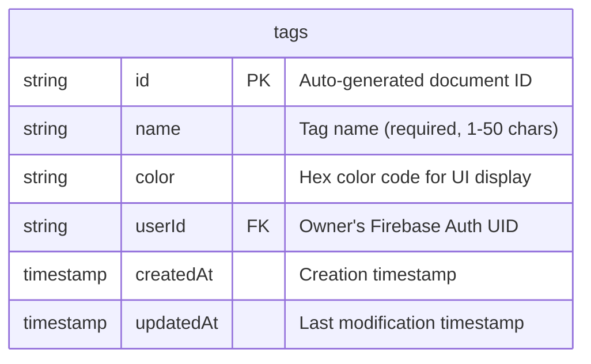

**Example Document:**
```json
{
  "id": "tag_electronics",
  "name": "Electronics",
  "color": "#2196F3",
  "userId": "user_xyz789",
  "createdAt": "2024-12-11T10:25:00Z",
  "updatedAt": "2024-12-11T10:25:00Z"
}
```

### 📂 Categories Collection

Categories provide hierarchical organization for items.

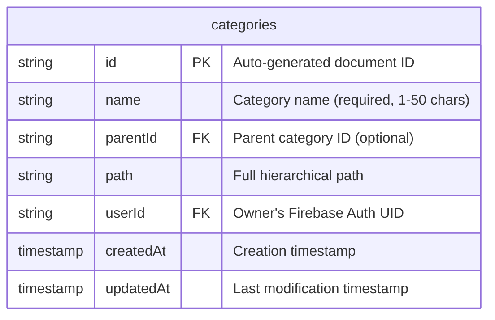

**Example Document:**
```json
{
  "id": "category_electronics_audio",
  "name": "Audio Equipment",
  "parentId": "category_electronics",
  "path": "Electronics > Audio Equipment",
  "userId": "user_xyz789",
  "createdAt": "2024-12-11T10:20:00Z",
  "updatedAt": "2024-12-11T10:20:00Z"
}
```

## 👥 User Management Schema

### 👤 User Profiles Collection

User profiles store account status and metadata for approved users.

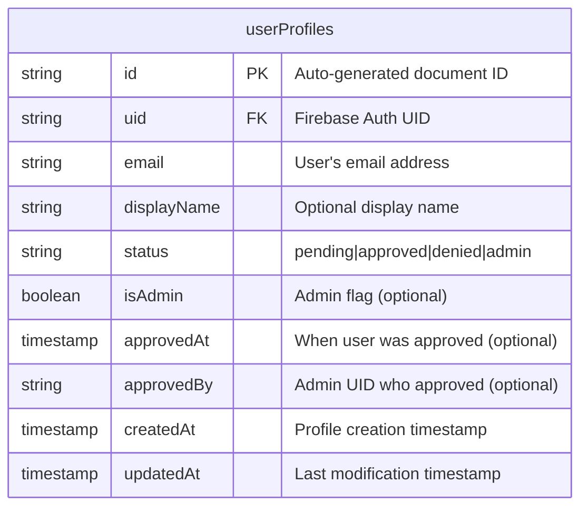

**Example Document:**
```json
{
  "id": "profile_ghi789",
  "uid": "user_xyz789",
  "email": "user@example.com",
  "displayName": "John Doe",
  "status": "approved",
  "isAdmin": false,
  "approvedAt": "2024-12-11T09:00:00Z",
  "approvedBy": "admin_abc123",
  "createdAt": "2024-12-10T15:30:00Z",
  "updatedAt": "2024-12-11T09:00:00Z"
}
```

### 📝 Registration Requests Collection

Registration requests manage the user approval workflow.

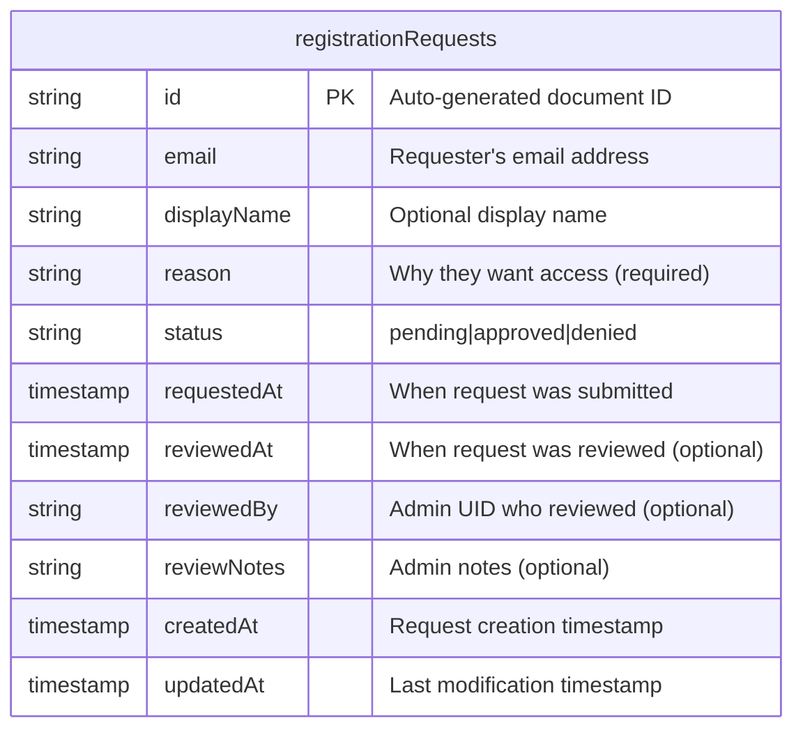

**Example Document:**
```json
{
  "id": "request_jkl012",
  "email": "newuser@example.com",
  "displayName": "Jane Smith",
  "reason": "I want to organize my home inventory and track my belongings",
  "status": "pending",
  "requestedAt": "2024-12-11T14:30:00Z",
  "reviewedAt": null,
  "reviewedBy": null,
  "reviewNotes": null,
  "createdAt": "2024-12-11T14:30:00Z",
  "updatedAt": "2024-12-11T14:30:00Z"
}
```

## 🔗 Relationships & Data Flow

### Entity Relationship Diagram

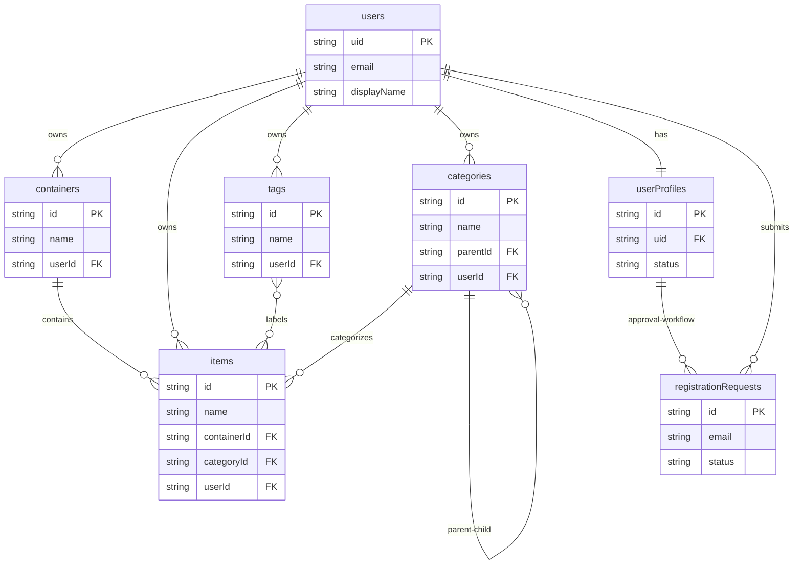

### Data Flow Diagram

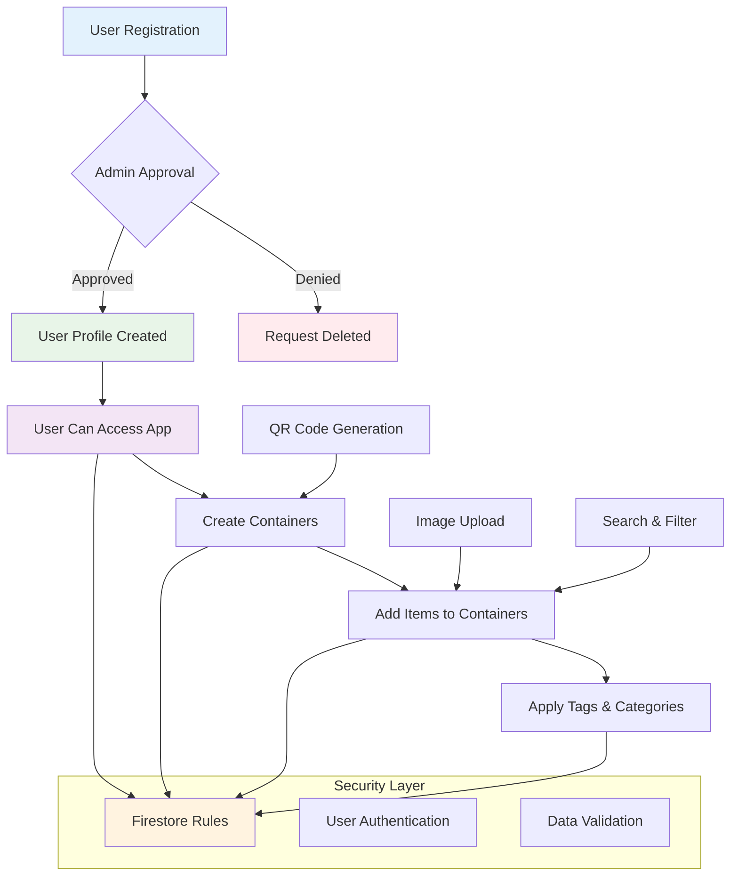

## 🔒 Security Model

### Access Control Rules

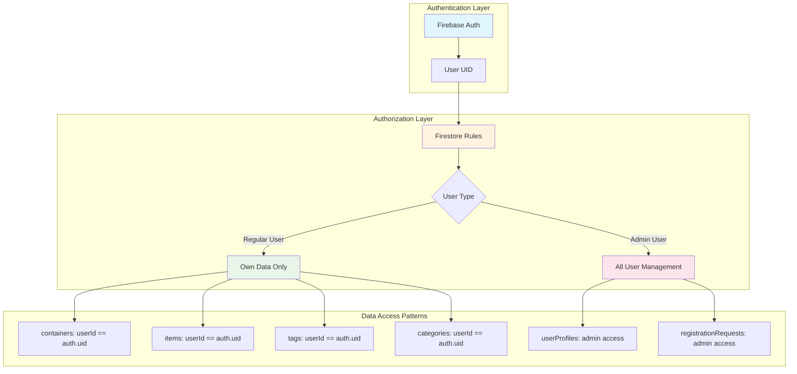

### Security Rules Summary

| Collection | Create | Read | Update | Delete |
|------------|--------|------|--------|--------|
| **containers** | Own data only | Own data only | Own data only | Own data only |
| **items** | Own data only | Own data only | Own data only | Own data only |
| **tags** | Own data only | Own data only | Own data only | Own data only |
| **categories** | Own data only | Own data only | Own data only | Own data only |
| **userProfiles** | Admin only | Own + Admin | Admin only | None |
| **registrationRequests** | Anyone | Own + Admin | Admin only | Admin only |

## 📊 Indexing Strategy

### Firestore Indexes

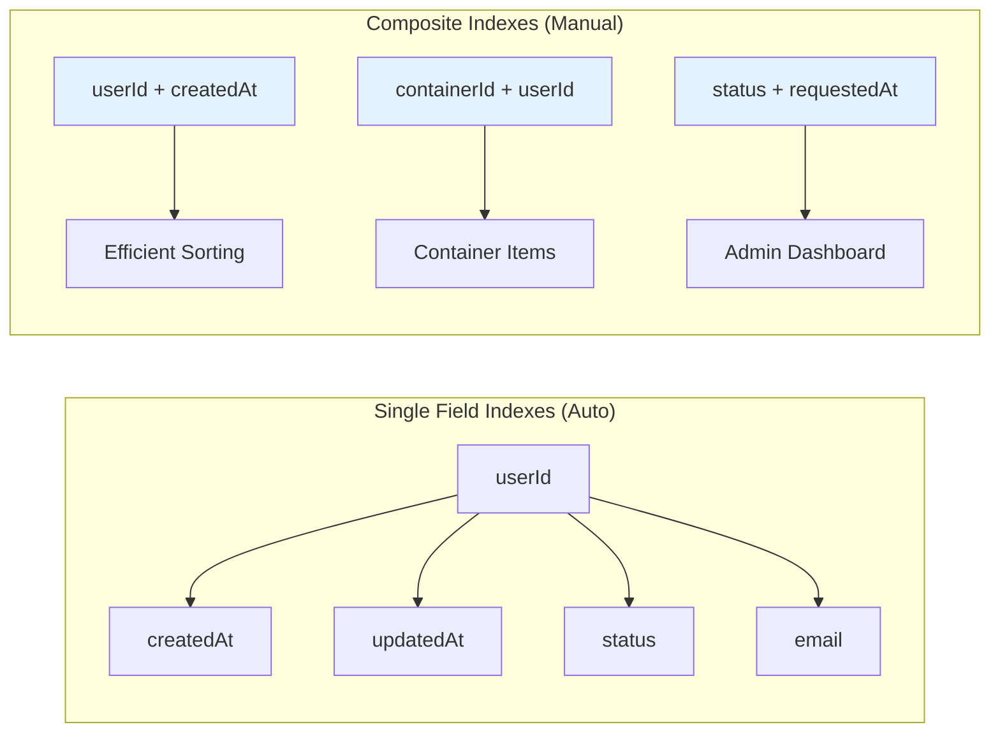

### Query Optimization

- **User Data Queries**: Always include `userId` filter first
- **Sorting**: Performed in JavaScript to avoid composite index requirements
- **Pagination**: Implemented using `startAfter` for large datasets
- **Search**: Client-side filtering for flexibility

## 🚀 Performance Considerations

### Data Size Limits

| Field Type | Limit | Usage |
|------------|-------|-------|
| **Document Size** | 1MB | Firestore limit |
| **Image Storage** | <1MB | Base64 compression |
| **String Fields** | Varies | See validation rules |
| **Array Fields** | 20,000 elements | Firestore limit |

### Optimization Strategies

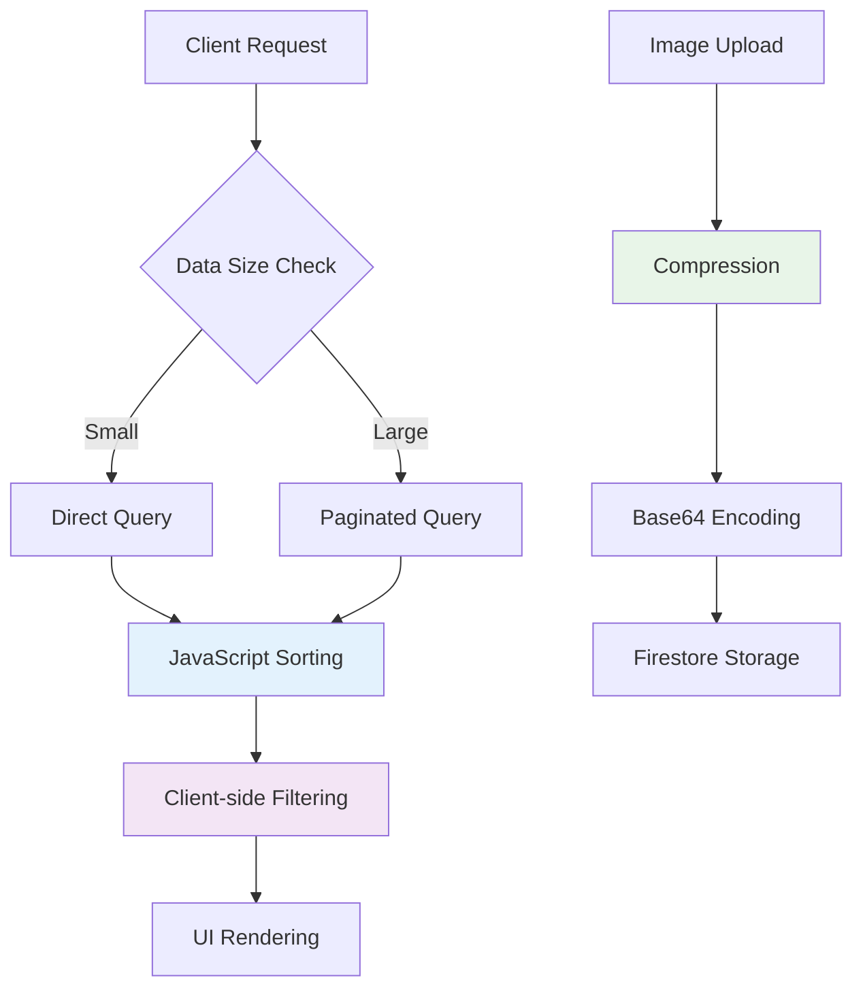

## 🔄 Data Migration & Versioning

### Schema Evolution

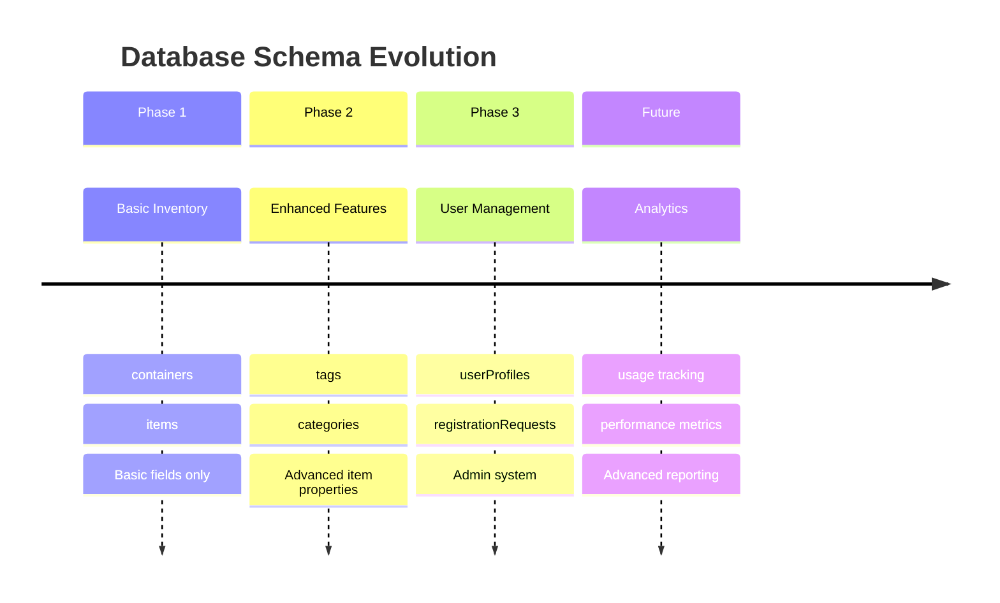

### Migration Strategy

- **Backward Compatibility**: New fields are optional
- **Gradual Rollout**: Features enabled progressively
- **Data Validation**: Firestore rules enforce schema compliance
- **Fallback Handling**: Client handles missing fields gracefully

## 📈 Monitoring & Analytics

### Key Metrics

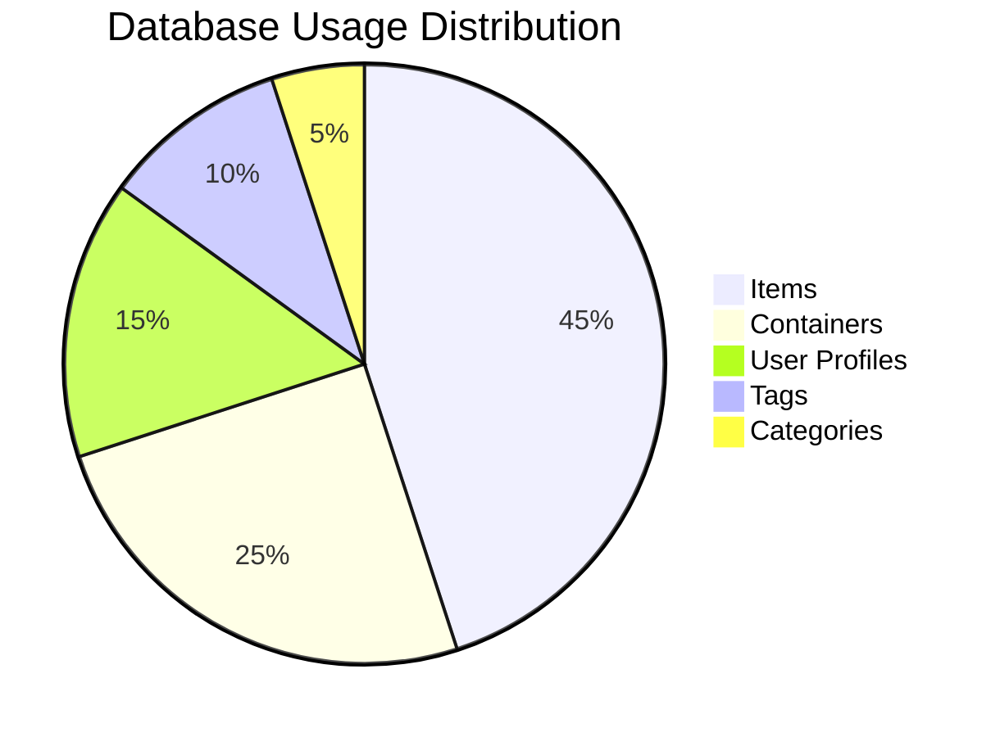

### Performance Monitoring

- **Query Performance**: Track response times
- **Storage Usage**: Monitor document sizes
- **User Activity**: Track CRUD operations
- **Error Rates**: Monitor failed operations

## 🎯 Best Practices

### Development Guidelines

1. **Always Include User ID**: Every query must filter by `userId`
2. **Validate Input**: Use Firestore rules for server-side validation
3. **Handle Offline**: Design for offline-first functionality
4. **Optimize Images**: Compress before storing
5. **Batch Operations**: Use transactions for related updates

### Security Best Practices

1. **Principle of Least Privilege**: Users access only their data
2. **Input Sanitization**: Validate all user inputs
3. **Audit Trails**: Track all administrative actions
4. **Regular Reviews**: Monitor access patterns
5. **Secure Defaults**: Deny access unless explicitly allowed

---

**This database schema supports a scalable, secure, and performant home inventory management system! 🏠📊**